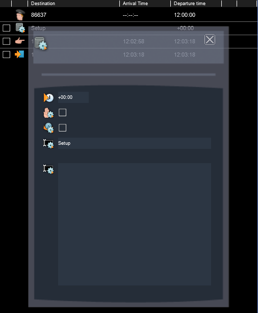

# AP-Class-86-Setup

This script provides a convenient and intuitive way to set up the [Armstrong Powerhouse Class 86](https://www.armstrongpowerhouse.com/class_86_enhancement_pack)

## Usage
To use this script, either copy the contents this script into ScenarioScript.lua or use it as a starting point for your scenario script.

In order for the script to run on startup, you need to create a trigger instruction on your player train called 'Setup' which should be the first instruction in the list.



You must then edit the scenario script according to your requirements.
```lua
    SetupClass86Cab {
        -- Remove this line and set up the cab as required.
    }
 ```

The following parameters are supported by this function:

| Parameter | Values | Description | Default State |
|-----------|--------|-------------|---------------|
| MasterKey| ON, OFF| Sets the state of the master key. If set to ON, the AWS change end switch is also turned ON.| OFF
|AwsSunflower| ON, OFF| Sets the state of the AWS sunflower indicator in the cab. | OFF
| InstrumentLights| ON, OFF | Sets the state of the instrument lights. | OFF
| HeadLight| ON, OFF | Sets the state of the headlight. | OFF
| TailLights| ON, OFF | Sets the state of the tail lights. | ON
| MarkerLights| ON, OFF | Sets the state of the marker lights. | OFF
| Reverser| REVERSE, NEUTRAL, FORWARD | Sets the position of the reverser handle. | NEUTRAL
| Brake | RUNNING, FIRST_APPLICATION, FULL_SERVICE, EMERGENCY, SHUTDOWN | Sets the position of the brake handle. | SHUTDOWN
| Wipers | OFF, SLOW, NORMAL, FAST | Sets the wiper speed. | OFF

## Example
```lua
    SetupClass86Cab {
        MasterKey = ON,
        AwsSunflower = ON,
        InstrumentLights = ON,
        HeadLight = ON,
        MarkerLights = ON,
        TailLights = OFF,
        Brake = FULL_SERVICE,
        Wipers = FAST
    }
```
## Notes
Please note this script only works if you're starting in the locomotive from the front cab. (No. 1 end)
